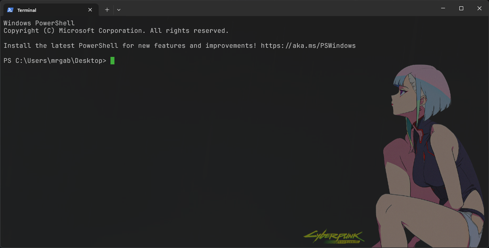

# Windows Terminal config



## How to use it?


### Pre requirements

1. Install JetBrainsMono font form the resources directory 
**or** download it from https://www.jetbrains.com/lp/mono/
2. Copy the image from the resource folder to your "userprofile/pictures" folder 
**or** to your preferred location

### Setup:

- Open a windows terminal

- Navigate to the settings or use the hotkey (ctrl +,) 

- In the bottom left corner, click on open JSON file (this will open a JSON file in your editor)

- Copy the content of the settings.json provided in this repo, and paste it in.

- Optional (if you placed your image elsewhere)
  Edit the background image location to match with your file location (where you pasted it)    `profiles/defaults/backgroundImage` 
  It should look like this:
  
  ```json
  {
     "profiles":{
        "defaults":{
           "backgroundImage":"%userprofile%\\Pictures\\lucy_transparent_HD.png",
           "backgroundImageAlignment":"bottomRight",
           "backgroundImageOpacity":0.3,
            ...
        }
     }
  }
  ```
    > Note: windows uses `\\` (double back slashes) to describe correctly the route
  - Save it
  - Open a new terminal window
  - Enjoy

> Feel free to poke around in your terminal settings, there is a reset button for everything ;)
